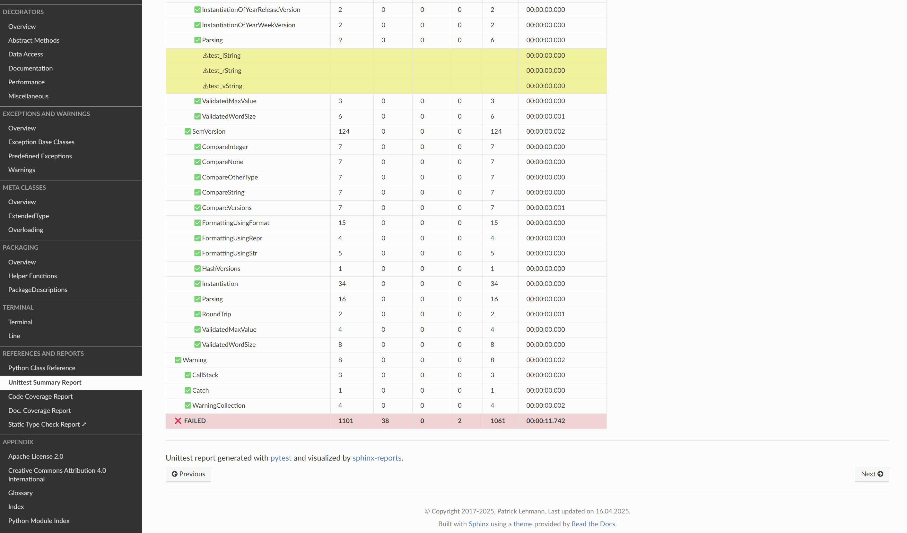
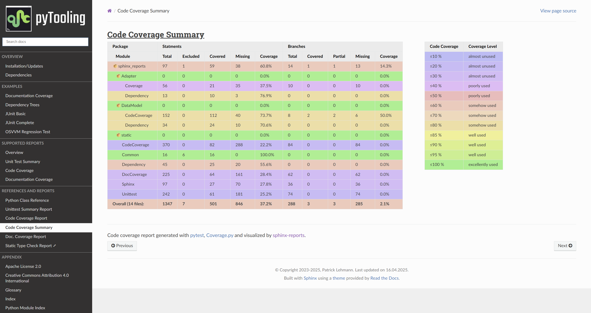
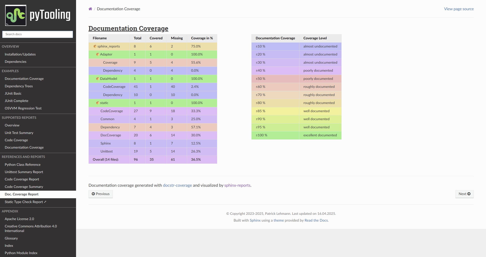

[](https://github.com/pyTooling/sphinx-reports)
[](LICENSE.md)
[](https://pyTooling.github.io/sphinx-reports/)
[](LICENSE.md)  
[](https://pypi.org/project/sphinx-reports/)

  
[](https://GitHub.com/pyTooling/sphinx-reports/actions/workflows/Pipeline.yml)
[](https://libraries.io/github/pyTooling/sphinx-reports)
[](https://www.codacy.com/gh/pyTooling/sphinx-reports)
[](https://www.codacy.com/gh/pyTooling/sphinx-reports)
[](https://codecov.io/gh/pyTooling/sphinx-reports)


<!--
[](https://github.com/pyTooling/sphinx-reports/releases)  
[](https://github.com/pyTooling/sphinx-reports/network/dependents)  
-->


# Sphinx Reports

The Sphinx extension `sphinx_reports` offers a set of directives to integrate reports and summaries into the
documentation generated by Sphinx.

Supported format reports are:
* ✅🚧 Unit Test summaries (by [pytest](https://github.com/pytest-dev/pytest))
  * ✅ Summary page (displaying `unittest.xml`)
  * 🚧 Show logging, output and error messages.
* 🚧 Code coverage (by [Coverage.py](https://github.com/nedbat/coveragepy))
  * ✅ Summary page (displaying `coverage.json`)
  * 🚧 Individual Sphinx documents per package/module
  * 🚧 Highlighted source code with syntax highlighting and coverage highlighting
* 🚧 Documentation coverage
  * ✅ Summary page (displaying data from ["""docstr_coverage"""](https://github.com/HunterMcGushion/docstr_coverage))
  * ❓ Additionally support [interrogate](https://github.com/econchick/interrogate) as data source.
  * 🚧 Individual Sphinx documents per package/module
  * 🚧 Highlighted source code with syntax highlighting and coverage highlighting 
* 🚧 Package Dependencies
  * 🚧 Summary page (displaying `requirements.txt`)


## Extension Configuration

This README demonstrates a quick and minimal configuration for the Sphinx extension and it's provided directives. See
the [sphinx-reports documentation](https://pyTooling.github.io/sphinx-reports) for more details.

At first, add the extension name to the list of extensions in `conf.py`, so the extension is loaded by Sphinx.

```Python
# Sphinx extensions
extensions = [
  # ...
  "sphinx_reports",
]
```

Each report directive might require an individual configuration, therefore see the next sections for details.


## Unittest Report Summary

The *Unittests Report* collects the success or failure of unittests. The results are typically stored in an XML file,
which can be read by **sphinx-reports**. After reading the structure of testsuites and testcases, the report can be
visualized. The user  




This is a quick and minimal configuration for the *unittest summary* directives.
See the [unittest](https://pyTooling.github.io/sphinx-reports/Unittest/index.html) documentation for more details.

<details><summary>Quick Configuration - Step-by-Step</summary>

1. Configure one or more coverage analysis reports in `conf.py` by adding a new 'section' defining some configuration
   variables. Each unittest report is identified by an ID, which is later referred to by the report directive. Here, the
   ID is called ``src`` (dictionary key). Each unittest report needs 1 configuration entry:

   * `xml_report` - The unittest report as XML file as generated by *pytest*.

   ```Python
   report_unittest_testsuites = {
     "src": {
       "xml_report": "../report/unit/unittest.xml"
     }
   }
   ```
2. Add the `unittest-summary` directive into your Restructured Text (ReST) document.

   * `reportid` - The ID used in `conf.py` to describe a report.

   ```ReST
   .. report:unittest-summary::
      :reportid: src
   ```

</details>

## Code Coverage Summary

*Code Coverage* checks if a source code was used during execution. Usually, testcases are run by a testcase execution
framework like [pytest](https://github.com/pytest-dev/pytest), which also offers to instrument the code for code
coverage collection using the `pytest-cov` plugin. For Python, coverage collection is usually based on
[Coverage.py](https://github.com/nedbat/coveragepy>), which supports statement and branch coverage collection either as
XML or JSON files. **sphinx-reports** can visualize a code coverage summary from JSON files. 




This is a quick and minimal configuration for the *code coverage* directives.
See the [code coverage](https://pyTooling.github.io/sphinx-reports/CodeCov/index.html) documentation for more details.

<details><summary>Quick Configuration - Step-by-Step</summary>

1. Configure one or more coverage analysis reports in `conf.py` by adding a new 'section' defining some configuration
   variables. Each analysis report is identified by an ID, which is later referred to by the report directive. Here, the
   ID is called ``src`` (dictionary key). Each analysis report needs 4 configuration entries:

   * `name` - Name of the Python package[^1].
   * `json_report` - The code coverage report as JSON file as generated by *Coverage.py*.
   * `fail_below` - An integer value in range 0..100, for when a code coverage is considered FAILED.
   * `levels` - A predefined color pallet name or a dictionary of coverage limits, their description and CSS style classes.

   ```Python
   # ==============================================================================
   # Sphinx-reports - CodeCov
   # ==============================================================================
   report_codecov_packages = {
     "src": {
       "name":        "myPackage",
       "json_report": "../report/coverage/coverage.json",
       "fail_below":  80,
       "levels":      "default"
     }
   }
   ```
2. Add the `code-coverage` directive into your Restructured Text (ReST) document.

   * `reportid` - The ID used in `conf.py` to describe a Python package.

   ```ReST
   .. report:code-coverage::
      :reportid: src
   ```

</details>


## Documentation Coverage Summary

*Documentation Coverage* counts how many publicly accessible members are documented using a Python *doc-string*. Based
on the count of possibly documented public members and the actual number of non-empty *doc-strings*, a percentage of
documentation coverage can be computed.

Documentation coverage is a measure of code quality, which expresses how well documented (completeness or documentation,
but not necessarily quality/helpfulness of documentation) source code is. Well documented code helps to use and maintain
the existing code base. It also allows for automated documentation generation.




This is a quick and minimal configuration for the *documentation coverage* directives.
See the [documentation coverage](https://pyTooling.github.io/sphinx-reports/DocCov/index.html) documentation for more
details.

<details><summary>Quick Configuration - Step-by-Step</summary>

1. Configure one or more Python packages for documentation coverage analysis in `conf.py` by adding a new 'section' 
   defining some configuration variables. Each package is identified by an ID, which is later referred to by the report
   directive. Here, the ID is called `src` (dictionary key). Each package needs 4 configuration entries:

   * `name` - Name of the Python package[^1].
   * `directory` - The directory of the package to analyze.
   * `fail_below` - An integer value in range 0..100, for when a documentation coverage is considered FAILED.
   * `levels` - A predefined color pallet name or a dictionary of coverage limits, their description and CSS style classes.

   ```Python
   # ==============================================================================
   # Sphinx-reports - DocCov
   # ==============================================================================
   report_doccov_packages = {
     "src": {
       "name":       "myPackage",
       "directory":  "../myPackage",
       "fail_below": 80,
       "levels":     "default"
     }
   }
   ```
2. Add the `doc-coverage` directive into your Restructured Text (ReST) document.
 
   * `reportid` - The ID used in `conf.py` to describe a Python package.

   ```ReST
   .. report:doc-coverage::
      :reportid: src
   ```

</details>


## Package Dependencies

🚧 In planning phase 🚧


## Contributors

* [Patrick Lehmann](https://github.com/Paebbels) (Maintainer)
* [and more...](https://GitHub.com/pyTooling/sphinx-reports/graphs/contributors)


## License

This Python package (source code) is licensed under [Apache License 2.0](LICENSE.md).  
The accompanying documentation is licensed under Creative Commons - Attribution-4.0 (CC-BY 4.0).


-------------------------

SPDX-License-Identifier: Apache-2.0


[^1]: Toplevel Python packages can reside in a directory not matching the package name. This is possible because the
      toplevel package name is set in the package installation description. This is not good practice, but possible and
      unfortunately widely used. E.g. `src` as directory name.
