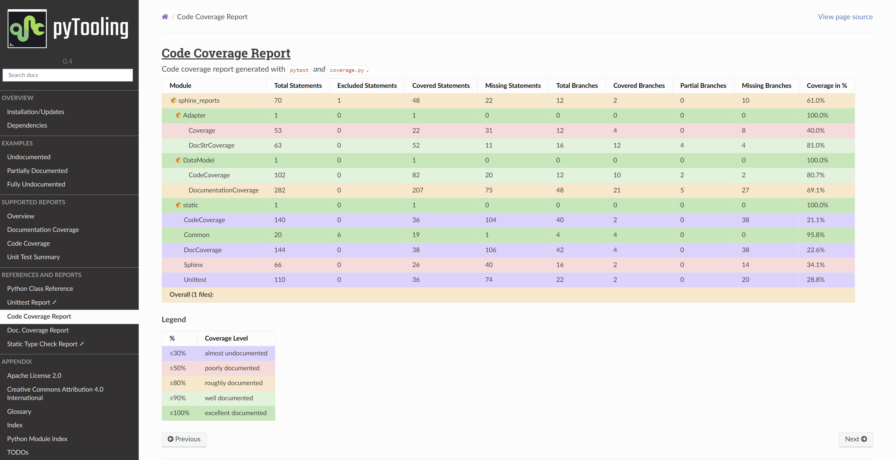

[](https://github.com/pyTooling/sphinx-reports)
[](LICENSE.md)
[](https://github.com/pyTooling/sphinx-reports/tags)
[](https://github.com/pyTooling/sphinx-reports/releases/latest)
[](https://github.com/pyTooling/sphinx-reports/releases)  
[](https://github.com/pyTooling/sphinx-reports/actions?query=workflow%3A%22Test%2C+Coverage+and+Release%22)
[](https://pypi.org/project/sphinx-reports/)


[](https://github.com/pyTooling/sphinx-reports/network/dependents)  
[](https://libraries.io/github/pyTooling/sphinx-reports)
[](https://requires.io/github/pyTooling/sphinx-reports/requirements/?branch=master)  
[](https://www.codacy.com/manual/pyTooling/sphinx-reports)
[](https://www.codacy.com/manual/pyTooling/sphinx-reports)
[](https://codecov.io/gh/pyTooling/sphinx-reports)
[](https://libraries.io/github/pyTooling/sphinx-reports/sourcerank)  
<!-- [](https://pyVersioning.readthedocs.io/en/latest/) -->


# Sphinx Reports

The Sphinx extension `sphinx_reports` offers a set of directives to integrate reports and summaries into the
documentation generated by Sphinx.

Supported format reports are:
* ✅ Documentation coverage (by [docstr_coverage](https://github.com/HunterMcGushion/docstr_coverage) (or `interrogate`?))
* 🚧 Code coverage (by [Coverage.py](https://github.com/nedbat/coveragepy))
  * ✅ Summary page (displaying `coverage.json`)
  * 🚧 Highlighted source code
* ✅🚧 Unit Test summaries (by [pytest](https://github.com/pytest-dev/pytest))
  * ✅ Summary page (displaying `unittest.xml`)
  * 🚧 Show logging, output and error messages.
* 🚧 Dependencies (reading `requirements.txt` files)




## Extension Configuration

This README demonstrates a quick and minimal configuration for the Sphinx extension and it's provided directives. See
the [sphinx-reports documentation](https://pyTooling.github.io/sphinx-reports) for more details.

At first, add the extension name to the list of extensions in `conf.py`, so the extension is loaded by Sphinx.

```Python
# Sphinx extensions
extensions = [
  # ...
  "sphinx_reports",
]
```

Each report directive might require an individual configuration, therefore see the next sections for details.

## Documentation Coverage

*Documentation Coverage* counts how many publicly accessible members are documented using a Python *doc-string*. Based
on the count of possibly documented public members and the actual number of non-empty *doc-strings*, a percentage of
documentation coverage can be computed.

Documentation coverage is a measure of code quality, which expresses how well documented (completeness or documentation,
but not necessarily quality/helpfulness of documentation) source code is. Well documented code helps to use and maintain
the existing code base. It also allows for automated documentation generation.


### Quick Configuration

This is a quick and minimal configuration for the *documentation coverage* directives.
See [documentation coverage](https://pyTooling.github.io/sphinx-reports/DocCov/index.html) documentation for more
details.

1. Configure one or more Python packages for documentation coverage analysis in `conf.py` by adding a new 'section' 
   defining some configuration variables. Each package is identified by an ID, which is later referred to by the report
   directive. Here, the ID is called `src` (dictionary key). Each package needs 4 configuration entries:

   * `name` - Name of the Python package[^1].
   * `directory` - The directory of the package to analyze.
   * `fail_below` - An integer value in range 0..100, for when a documentation coverage is considered FAILED.
   * `levels` - A dictionary of coverage limits, their description and CSS style classes.

   ```Python
   # ==============================================================================
   # Sphinx-reports - DocCov
   # ==============================================================================
   report_doccov_packages = {
     "src": {
       "name":       "myPackage",
       "directory":  "../myPackage",
       "fail_below": 80,
       "levels": {
         30:      {"class": "report-cov-below30",  "desc": "almost undocumented"},
         50:      {"class": "report-cov-below50",  "desc": "poorly documented"},
         80:      {"class": "report-cov-below80",  "desc": "roughly documented"},
         90:      {"class": "report-cov-below90",  "desc": "well documented"},
         100:     {"class": "report-cov-below100", "desc": "excellent documented"},
         "error": {"class": "report-cov-error",    "desc": "internal error"},
       },
     }
   }
   ```
2. Add the `doc-coverage` directive into your Restructured Text (ReST) document.
   
   * `packageid` - The ID used in `conf.py` to describe a Python package.
   * `legend` (optional) - Position of the legend (`no_legend`, `top`, `bottom`, `both`)

   ```Python
   .. report:doc-coverage::
      :packageid: src
   ```

## Code Coverage

*Code Coverage* checks if a source code was used during execution. Usually, testcases are run by a testcase execution
framework like [pytest](https://github.com/pytest-dev/pytest), which also offers to instrument the code for code
coverage collection using the `pytest-cov` plugin. For Python, coverage collection is usually based on
[Coverage.py](https://github.com/nedbat/coveragepy>), which supports statement and branch coverage collection.

### Quick Configuration

This is a quick and minimal configuration for the *code coverage* directives.
See [code coverage](https://pyTooling.github.io/sphinx-reports/CodeCov/index.html) documentation for more
details.

1. Configure one or more coverage analysis reports in `conf.py` by adding a new 'section' defining some configuration
   variables. Each analysis report is identified by an ID, which is later referred to by the report directive. Here, the
   ID is called ``src`` (dictionary key). Each analysis report needs 4 configuration entries:

   * `name` - Name of the Python package[^1].
   * `json_report` - The code coverage report as JSON file as generated by *Coverage.py*.
   * `fail_below` - An integer value in range 0..100, for when a code coverage is considered FAILED.
   * `levels` - A dictionary of coverage limits, their description and CSS style classes.

   ```Python
   # ==============================================================================
   # Sphinx-reports - CodeCov
   # ==============================================================================
   report_codecov_packages = {
     "src": {
       "name":        "myPackage",
       "json_report": "../report/coverage/coverage.json",
       "fail_below":  80,
       "levels": {
         30:      {"class": "report-cov-below30",  "desc": "almost unused"},
         50:      {"class": "report-cov-below50",  "desc": "poorly used"},
         80:      {"class": "report-cov-below80",  "desc": "medium used"},
         90:      {"class": "report-cov-below90",  "desc": "well well"},
         100:     {"class": "report-cov-below100", "desc": "excellent used"},
         "error": {"class": "report-cov-error",    "desc": "internal error"},
       },
     }
   }
   ```
2. Add the `code-coverage` directive into your Restructured Text (ReST) document.
   
   * `packageid` - The ID used in `conf.py` to describe a Python package.
   * `legend` (optional) - Position of the legend (`no_legend`, `top`, `bottom`, `both`)

   ```Python
   .. report:code-coverage::
      :packageid: src
   ```

## Unit Test Summary

```
UnitTest: write introduction
```


## Dependencies

```
Dep: write introduction
```


## Contributors

* [Patrick Lehmann](https://github.com/Paebbels) (Maintainer)
* [and more...](https://GitHub.com/pyTooling/sphinx-reports/graphs/contributors)


## License

This Python package (source code) is licensed under [Apache License 2.0](LICENSE.md).  
The accompanying documentation is licensed under Creative Commons - Attribution-4.0 (CC-BY 4.0).


-------------------------

SPDX-License-Identifier: Apache-2.0


[^1]: Toplevel Python packages can reside in a directory not matching the package name. This is possible because the
      toplevel package name is set in the package installation description. This is not good practice, but possible and
      unfortunately widely used. E.g. `src` as directory name.
